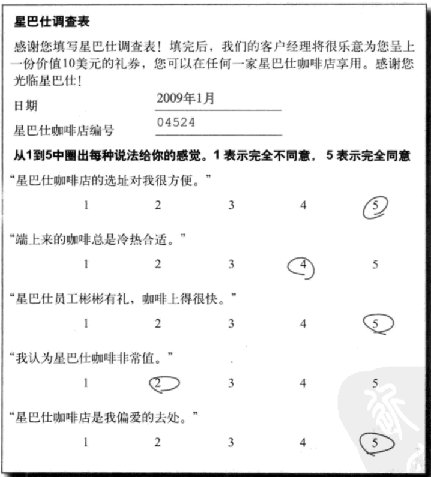
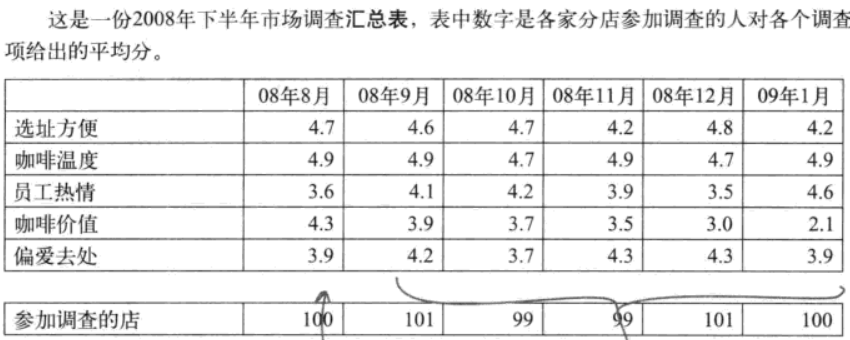
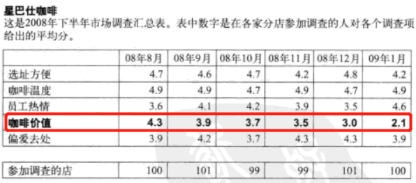
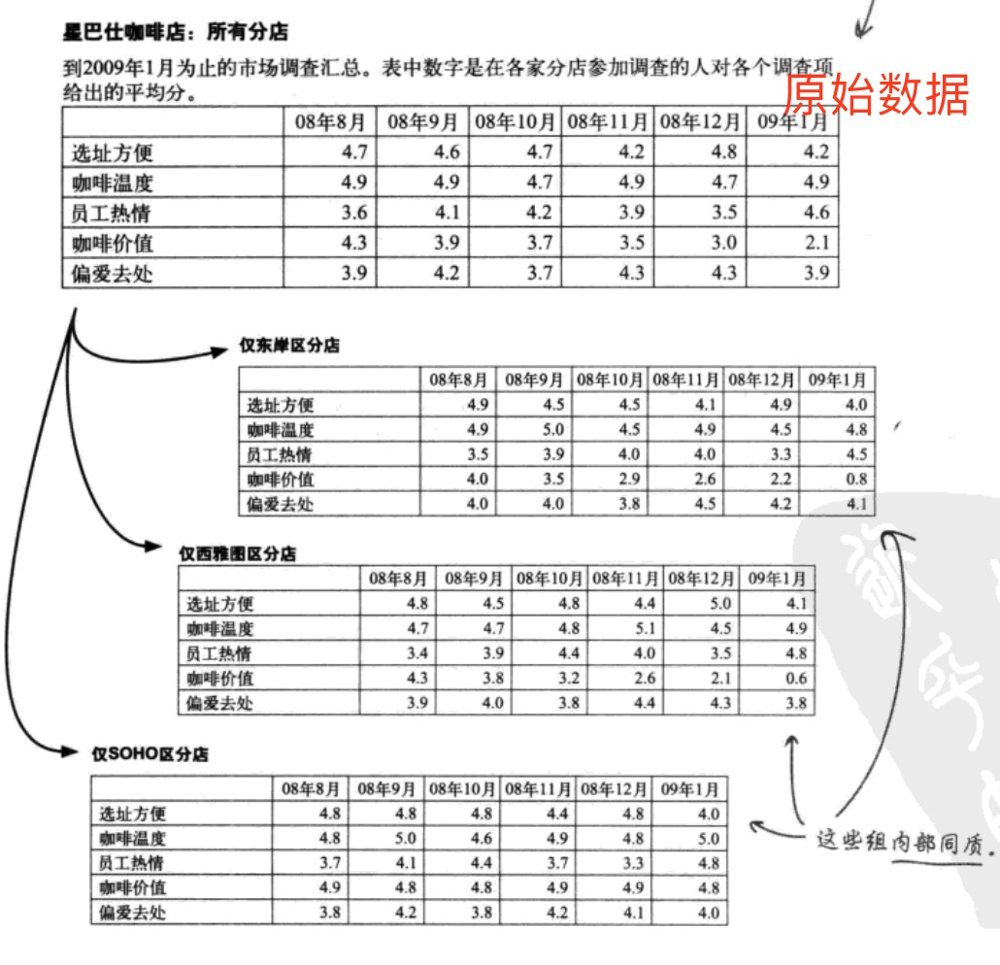

# 实验：评估决策
* 好的实证实验，既能解决问题又能揭示事物真正的运行规律。
  * 好的实验往往能让你摆脱对**观察数据**的无限依赖，能帮助你理清关系；可靠的**实证数据**将让你的分析判断更有说服力。

## 1 实验数据：抽样采集

### 1.1 抽样调查表

### 1.2 抽样结果表

## 2 实验评估

### 2.1 比较的意义
#### 比较才能让数据发挥作用
* 在统计与分析中，数据只有通过相互比较才会有意义。
* 针对一份有用的统计数据，需要将其与其它统计数据比较才能解释为什么会有某种作用。

#### 比较能帮助探索问题
**比较越多，分析结果越正确**

对于观察研究尤其如此。
* 观察研究法：被研究的人自行决定自己属于哪个群体的一种方法。（而在实验中，则由你决定哪些人属于哪些群体。）

#### 案例
价值感是导致销售收入下滑的原因吗？

## 3 设计有效地实验
针对“价值感是导致销售收入下滑的原因吗？”进行实验设计。
### 3.1 为什么要进行实验
* 1.用实际情况评估决策，提升决策的说服力或是否定决策
* 2.量化实验提升或降低的效果
* 3.检验数据的关联关系

### 3.2 通过实验我们能收获什么
* 1.检验我们分析的过程，开阔数据分析师的视野
* 2.对预期结果的量化，提升预估能力
* 3.揭示事物真正的运行规律

#### 3.3 如何设计实验？

#### 3.1 混杂因素校正
**混杂因素**就是研究对象的个人差异，它们不是你试图进行比较的因素，最终会导致分析结果的敏感度变差。例如：地址附近的人群富有与否。

##### 拆解所有子项的数据

#### 3.2 设置对照实验
好的实验总是有一个控制组（对照组），使分析师能够将检验情况与现状进行比较。

控制组保持原有状态即可，实验组做策略调整。

#### 3.3 控制变量法
单一变量的改变引起结果的改变则证明该变量与结果具有相关性。
